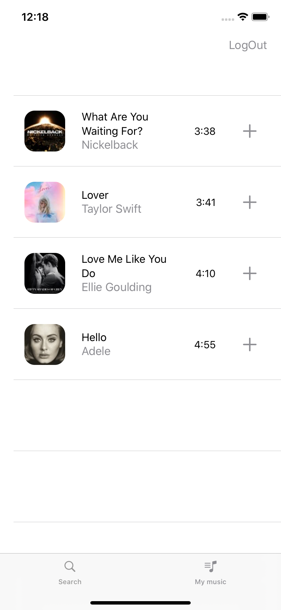

# MusicApp

- SwiftUI
- AVPlayer
- Timer
- DocumentDirectory
- UserDefaults
- [Firebase/Auth](https://firebase.google.com/)
- [Firebase/Database](https://firebase.google.com/)
- [Alamofire](https://github.com/Alamofire/Alamofire)
- [SwiftyJSON](https://github.com/SwiftyJSON/SwiftyJSON)
- [SDWebImageSwiftUI](https://github.com/SDWebImage/SDWebImageSwiftUI)

## Sreens

     
